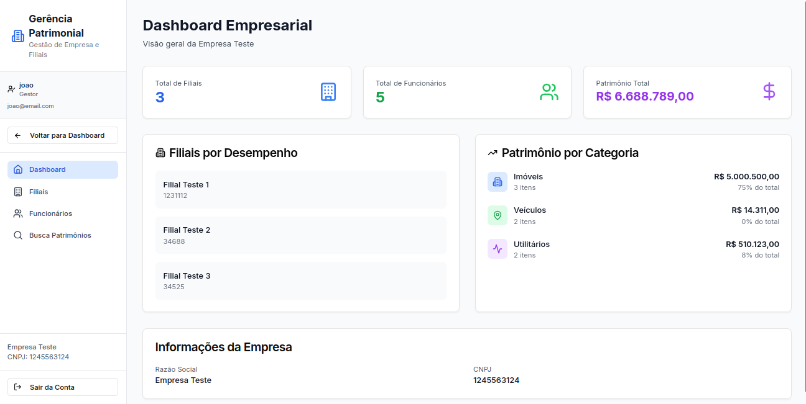
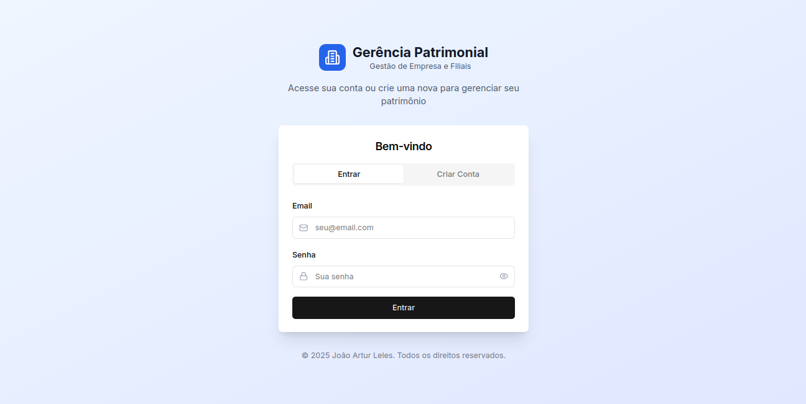
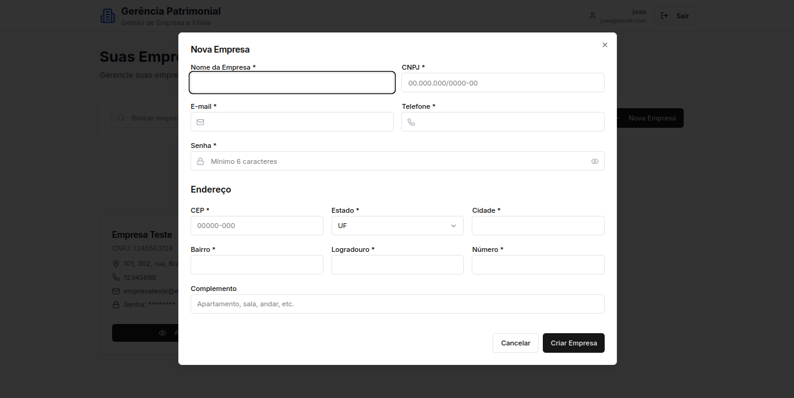
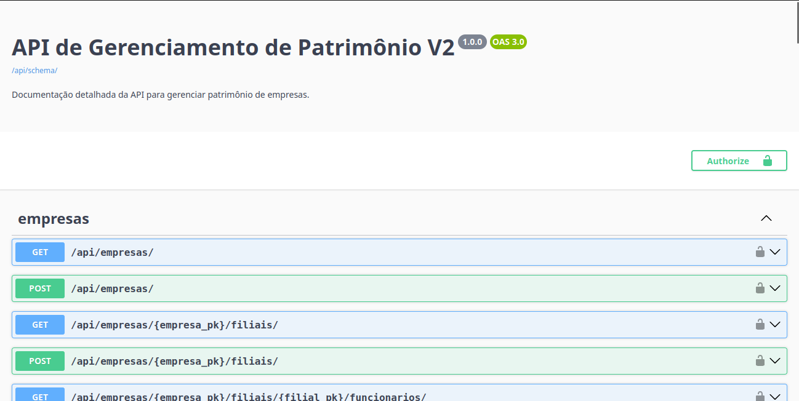

# Gerência Patrimonial V2 - Sistema de Gestão de Empresa e Filiais

## 📖 Sobre o Projeto

**Gerência Patrimonial V2** é uma aplicação Full-Stack completa para gestão de patrimônio empresarial. A plataforma permite que gestores se cadastrem, criem suas empresas, filiais e contratem funcionários.

Este projeto foi desenvolvido utilizando as melhores práticas de desenvolvimento, desde a conteinerização com Docker até a integração contínua.

### 🔗 Links Úteis
| Recurso | Link |
| :--- | :--- |
| **Aplicação** | [gerencia-patrimonial.vercel.app](https://gerencia-patrimonial.vercel.app/) |
| **Documentação da API** | [gerencia-patrimonial-api.onrender.com](https://gerencia-patrimonial-api.onrender.com/api/schema/swagger-ui/) |
| **Documentação (Artefatos)** | [joao-artl.github.io/Gerencia_Patrimonial_V2/](https://joao-artl.github.io/Gerencia_Patrimonial_V2/) |
| **Repositório (Front-End)** | [github.com/joao-artl/Gerencia_Patrimonial_V2_Front_End](https://github.com/joao-artl/Gerencia_Patrimonial_V2_Front_End) |

## ✨ Funcionalidades Principais

<table>
  <tr>
    <td align="center">
      <strong>Dashboards Dinâmicos</strong><br>
      
      <p>Visões gerais para gestores com dados consolidados de toda a empresa.</p>
    </td>
    <td align="center">
      <strong>Autenticação Segura</strong><br>
      
      <p>Sistema de login e cadastro com tokens JWT (Access & Refresh Tokens).</p>
    </td>
  </tr>
  <tr>
    <td align="center">
      <strong>Gerenciamento de Entidades</strong><br>
      
      <p>CRUD completo para Empresas, Filiais e Funcionários.</p>
    </td>
    <td align="center">
      <strong>Gestão de Patrimônio</strong><br>
      
      <p>Cadastro e gerenciamento de múltiplos tipos de patrimônios.</p>
    </td>
  </tr>
    <tr>
    <td align="center">
      <strong>Busca e Filtros</strong><br>
      
      <p>Funcionalidades de busca e filtro em todas as listagens.</p>
    </td>
    <td align="center">
      <strong>Documentação de API</strong><br>
      
      <p>Documentação interativa gerada automaticamente com Swagger/OpenAPI.</p>
    </td>
  </tr>
</table>

## 🛠️ Tecnologias Utilizadas

| Categoria | Tecnologia |
| :--- | :--- |
| **Backend** | Django, Django REST Framework, Simple JWT, Gunicorn, WhiteNoise |
| **Frontend**| Next.js, React, TypeScript, Axios, Tailwind CSS |
| **Banco de Dados**| PostgreSQL |
| **DevOps & Infra**| Docker, Docker Compose, Vercel (Frontend), Render (Backend) |
| **Testes** | Pytest, Selenium (Testes E2E), Requests (Testes de API) |
| **Documentação**| drf-spectacular (Swagger UI / ReDoc), Docsify |


## 🚀 Como Rodar Localmente (Backend)

O ambiente de desenvolvimento do backend é totalmente conteinerizado com Docker.

1.  **Pré-requisitos:**
    * [Docker](https://www.docker.com/products/docker-desktop/)
    * [Docker Compose](https://docs.docker.com/compose/install/)

2.  **Clone o repositório:**
    ```bash
    git clone https://github.com/joao-artl/Gerencia_Patrimonial_V2.git
    cd Gerencia_Patrimonial_V2/
    ```

3.  **Crie o arquivo de ambiente:**
    * Crie uma cópia do arquivo `.env.example` e renomeie para `.env`.
    * Preencha as variáveis, como a `SECRET_KEY`.

4.  **Suba os containers:**
    ```bash
    docker-compose up --build
    ```

5.  **Acesso:**
    * A API estará disponível em: `http://localhost:8000/api/`
    * A documentação interativa (Swagger UI) estará em: `http://localhost:8000/api/schema/swagger-ui/`

6.  **Para rodar o linter**
    ```bash
    docker compose --profile tools run --rm lint
    ```

7.  **Para parar os containers:**
    ```bash
    docker compose down -v
    ```