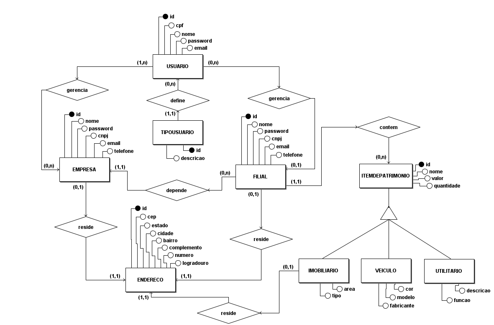
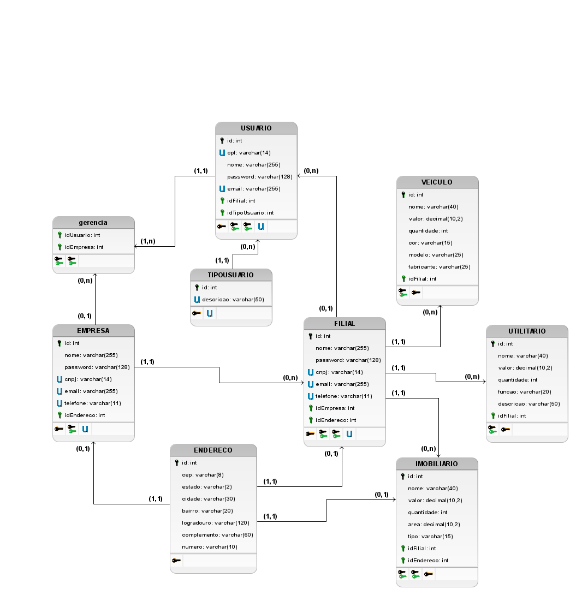

# Especificação da Modelagem do Banco de Dados

## <a>1.1. DER</a>

_Fonte: [João Artur Leles](https://github.com/joao-artl)_

## <a>1.2. DLD</a>

_Fonte: [João Artur Leles](https://github.com/joao-artl)_

## <a>Histórico de versão</a>

| Versão | Data | Descrição | 
| :------: | :----------: | :-----------: |
| `1.0` | 12/06/2025 | Criação do documento sobre a especificação da modelagem do banco de dados |