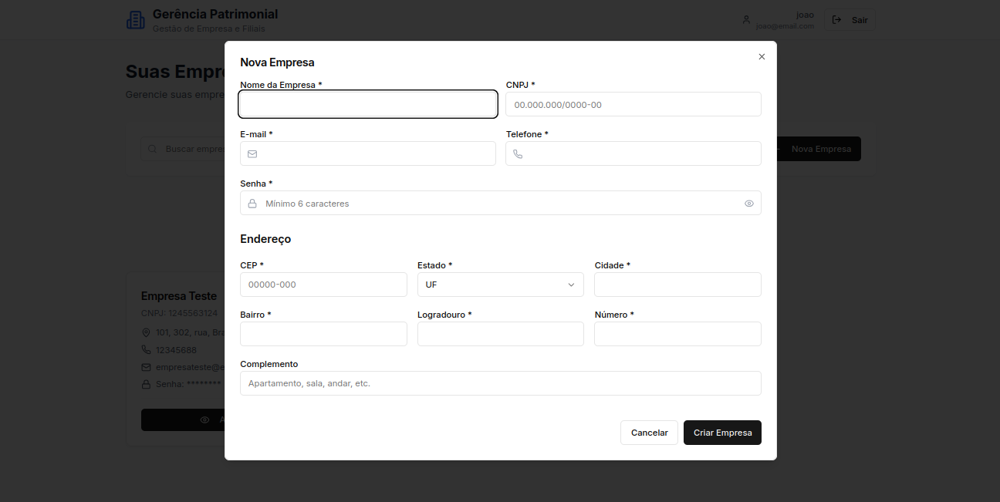
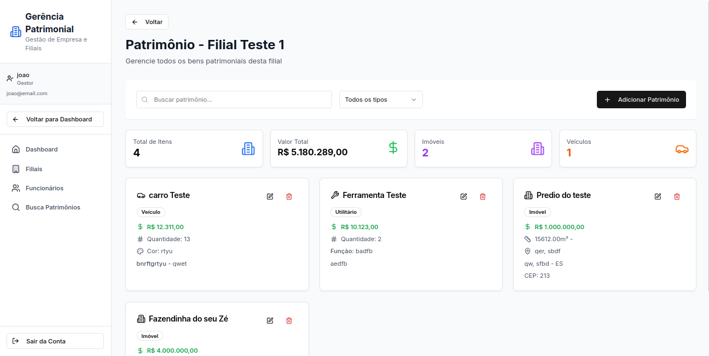
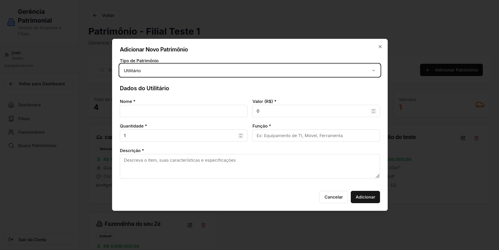

# Protótipo de Alta Fidelidade

## <a>Introdução</a>

Este documento apresenta o protótipo de alta fidelidade do sistema de gestão patrimonial, com foco na usabilidade e na organização das interfaces. As telas aqui descritas ilustram o fluxo completo de uso da aplicação, desde o login inicial até o gerenciamento de empresas, filiais e patrimônios, servindo como base visual para validação do sistema.

## <a>1. Tela Inicial</a>

### <a>1.1. Tela de Login</a>

_Fonte: [João Artur Leles](https://github.com/joao-artl)_

### <a>1.2. Tela de Cadastro</a>

_Fonte: [João Artur Leles](https://github.com/joao-artl)_

## <a>2. Tela da Empresa</a>

_Fonte: [João Artur Leles](https://github.com/joao-artl)_

### <a>2.1. Tela de Cadastro da Empresa</a>

_Fonte: [João Artur Leles](https://github.com/joao-artl)_

### <a>2.2. Tela de Conexão à Empresa Existente</a>

_Fonte: [João Artur Leles](https://github.com/joao-artl)_

### <a>2.3. Tela para Conectar um Outro Gestor a Empresa</a>

_Fonte: [João Artur Leles](https://github.com/joao-artl)_

## <a>3. Dashboard da Empresa</a>

_Fonte: [João Artur Leles](https://github.com/joao-artl)_

### <a>3.1. Tela das Filiais</a>

_Fonte: [João Artur Leles](https://github.com/joao-artl)_

#### <a>3.1.1. Tela de Cadastro das Filiais</a>

_Fonte: [João Artur Leles](https://github.com/joao-artl)_

### <a>3.2. Tela dos Patrimônios</a>

_Fonte: [João Artur Leles](https://github.com/joao-artl)_

#### <a>3.2.1. Tela de Cadastro de Imobiliário</a>

_Fonte: [João Artur Leles](https://github.com/joao-artl)_

#### <a>3.2.2. Tela de Cadastro de Veículo</a>

_Fonte: [João Artur Leles](https://github.com/joao-artl)_

#### <a>3.2.3 Tela de Cadastro de Utilitário</a>

_Fonte: [João Artur Leles](https://github.com/joao-artl)_

### <a>3.3. Tela de Busca Global De Patrimônios</a>

_Fonte: [João Artur Leles](https://github.com/joao-artl)_

## <a>Histórico de versão</a>

| Versão | Data | Descrição | 
| :------: | :----------: | :-----------: |
| `1.0` | 18/07/2025 | Criação do documento sobre o protótipo de alta fidelidade |